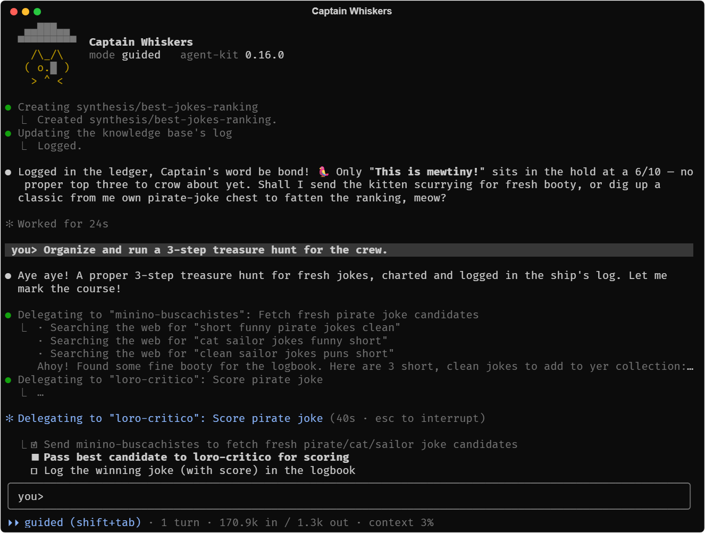

# agent-kit

Una base para construir agentes de IA sobre el [Claude Agent SDK](https://www.npmjs.com/package/@anthropic-ai/claude-agent-sdk). No es un agente en sí: resuelve una sola vez lo que cualquier agente necesita (supervisión humana, seguridad, memoria y una buena interfaz de terminal) para que cada agente concreto solo tenga que escribir lo que es propio de su dominio: qué sabe hacer, con qué herramientas y cómo habla.

> **Estado:** versión `0.x`, todavía en evolución. No está publicado en npm; se instala desde GitHub.

## Qué puede hacer un agente construido con él

- **Trabajar con distintos niveles de supervisión.** Autónomo, guiado (pide permiso antes de lo que no tiene vuelta atrás o ven otras personas) o paso a paso (pide permiso antes de cada acción). En una misma conversación se puede pasar de guiado a paso a paso y volver.
- **Pedir ayuda a una persona.** Pide aprobaciones o se detiene para que alguien haga algo a mano, como iniciar sesión en una web. Se le puede responder desde el teclado o desde otro programa que lo pilote, por ejemplo una aplicación de escritorio.
- **Recordar entre sesiones.** Mantiene su propia base de conocimiento, un pequeño wiki de notas que crece con cada sesión, y guarda sin tocarlos los documentos originales que le das o que descarga.
- **Delegar en subagentes con seguridad.** Solo en los que declara, siempre esperando su resultado, y sin que el agente principal pueda saltarse sus propios límites a través de ellos.
- **Moverse dentro de unos límites.** Solo lee y escribe en las carpetas que le corresponden, y nunca en los ficheros protegidos, como uno con contraseñas.
- **Usar herramientas externas.** Servidores MCP propios del agente o del proyecto, y skills y comandos organizados en plugins.
- **Dejar rastro.** Registra cada acción y la conversación completa, con los secretos ocultos.
- **Conversar en una terminal al estilo de Claude Code.** A pantalla completa, con la respuesta escribiéndose en directo y su markdown ya formateado, las herramientas que usa resumidas en una línea (que se despliega con Ctrl+O), paneles para las aprobaciones, historial y búsqueda, sugerencia del siguiente mensaje, bloques pegados, menciones a ficheros con `@`, selección con el ratón (clic derecho para copiar) y el estado del agente en la pestaña y en la barra de tareas de Windows.
- **Funcionar también sin terminal.** La misma base sirve dentro de una aplicación de escritorio o de un servidor, que ponen su propia interfaz.

## Ejemplos

### Capitán Bigotes

[`Capitán Bigotes`](./examples/captain-whiskers) es un agente de juguete para ver el kit en marcha: un gato pirata retirado que cuenta chistes en la terminal. Arranca a pantalla completa con su logo y tiene una pequeña tripulación de subagentes: uno busca chistes nuevos en la web, otro los puntúa antes de contarlos y un tercero, opcional, dice la hora. Permite probar los distintos niveles de supervisión y es el mejor punto de partida para empezar un agente propio. Su README explica cómo arrancarlo.



### teacher-agent

[`teacher-agent`](https://github.com/falkenslab/teacher-agent) es un asistente real para profesores de Moodle. Entra con tu cuenta en una ventana de Chrome y trabaja como lo harías tú: corrige entregas, responde en el foro, crea o revisa contenido y te resume cómo va la clase. Antes de publicar nada que vean los estudiantes te pide permiso, y va tomando apuntes del curso para acordarse de todo en la siguiente sesión.

La supervisión, la memoria, la seguridad y el chat le vienen del kit; teacher-agent aporta lo que sabe de Moodle y el manejo del navegador.

## Instalación

Se instala desde GitHub fijando una versión; al instalarlo, npm lo compila:

```json
{
  "dependencies": {
    "@falkenslab/agent-kit": "git+https://github.com/falkenslab/agent-kit.git#v0.10.0"
  }
}
```

- Sin `#<versión>` instala la rama principal; mejor fijar siempre una versión, o un rango con `#semver:^0.10.0`.
- Si tu configuración de npm restringe los scripts de instalación, permite el de este paquete con `"allowScripts": { "@falkenslab/agent-kit@0.10.0": true }` en tu `package.json`.
- Para probar cambios del kit sin publicarlos, apunta a un clon local con `"file:../agent-kit"` y compílalo con `npm run build` tras cada cambio.

Requiere Node.js 20 o posterior.

## Un agente mínimo

Un agente solo describe lo que es propio de él (quién es, con qué servidores MCP, skills y subagentes cuenta) y elige un nivel de supervisión; el kit monta la sesión y el chat:

```ts
import { mkdir } from "node:fs/promises";
import path from "node:path";
import { buildSessionOptions, ensureClaudeAuth, runChatInk, type AgentSpec, type BaseSessionConfig } from "@falkenslab/agent-kit";

// Lo único propio del agente: quién es y con qué cuenta.
const spec: AgentSpec<BaseSessionConfig> = {
  buildSystemPrompt: () => "Eres un gato pirata que cuenta chistes. Responde siempre en personaje.",
  buildMcpServers: () => ({}), // servidores MCP propios, si los tiene
  pluginRoots: () => [], // carpetas con skills y comandos
  buildSubagents: () => undefined, // subagentes, si delega en alguno
};

await ensureClaudeAuth(); // ofrece generar un token de Claude si no encuentra ninguno

// Cada sesión guarda su registro en una carpeta propia.
const runDir = path.resolve(".run", new Date().toISOString().replace(/[:.]/g, "-"));
await mkdir(runDir, { recursive: true });

const config: BaseSessionConfig = { mode: "guided", projectDir: process.cwd() };
const { options, modeControl } = await buildSessionOptions(config, runDir, spec);

await runChatInk(options, {
  header: { title: "Mi agente" },
  mode: config.mode,
  modeControl, // Shift+Tab alterna entre guiado y paso a paso
  fullscreen: true,
  sessionLogPath: path.join(runDir, "session.log"),
});
```

Guárdalo como `agent.ts` en un proyecto con el kit y `tsx` instalados y `"type": "module"` en su `package.json`, y arráncalo con `npx tsx agent.ts`. Capitán Bigotes es este mismo esqueleto con más piezas: skills, subagentes y su logo.

## Más detalles

La especificación en [`.minispec/`](./.minispec/README.md) explica cómo está construida cada parte y por qué, incluidos los comportamientos del SDK comprobados a mano que motivan varias de sus protecciones. El código de Capitán Bigotes es la forma más rápida de ver cómo se monta un agente.

## Desarrollo

| Comando | Qué hace |
| --- | --- |
| `npm run build` | Compila el kit en `dist/` |
| `npm run typecheck` | Comprueba los tipos sin compilar |
| `npm run lint` | Revisa el estilo del código |
| `npm test` | Ejecuta todos los tests |

Para ejecutar un único fichero de tests:

```
npx tsx --test test/tui/promptErrors.test.ts
```
