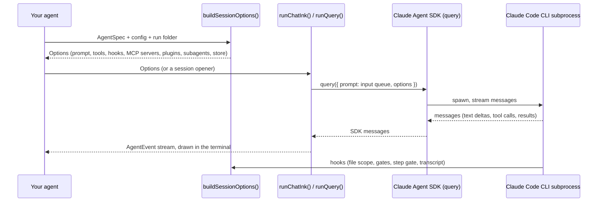

# Architecture

## The flow

1. **Your agent** implements an [`AgentSpec`](agent-spec.md) and builds a [config](session-config.md).
2. **[`buildSessionOptions()`](session-options.md)** turns them into the SDK's `Options`: the system prompt, the tools the configuration grants, the kit's own MCP servers (approvals, manual intervention, save to sources), the security hooks, plugins and subagents.
3. **A runner** starts the session: `runChatInk()` or `runChatTui()` for a conversation, [`runQuery()`](../advanced/events.md) for anything else. They wrap the SDK's `query()`.
4. **The SDK** runs the Claude Code CLI as a subprocess. The CLI calls the model, runs the tools and calls the kit's hooks before and after each tool call.
5. **`runQuery()`** turns the SDK's raw message stream into a small set of [`AgentEvent`s](../advanced/events.md), which the terminal UI draws or your own host forwards.

## Two layers

The kit is split so the same agent can run in a terminal or inside another program:

| Layer | Folder | Rule | What's in it |
| --- | --- | --- | --- |
| Core | `src/core/` | Never touches `console`, `process.stdout` or `readline` | `AgentSpec`, `buildSessionOptions()`, `runQuery()`, hooks, the kit's MCP tools, the knowledge base, runs, languages, the interaction port |
| Terminal UI | `src/tui/` | The only code that assumes a terminal | The Ink chat, the plain chat, the progress view, the wizard, `ensureClaudeAuth()`, the terminal interaction port, the palette and themes |

Both are exported from the package root; nothing forces a desktop app to load the terminal UI's code paths, and nothing in the core prints anything. A checkpoint (an approval, say) reaches the person through an [`InteractionPort`](../human-in-the-loop/interaction-port.md): the terminal installs its own by default, a desktop app installs one that opens a dialog.

## Key pieces

| Piece | Kind | Page |
| --- | --- | --- |
| `AgentSpec<TConfig>` | interface you implement | [AgentSpec](agent-spec.md) |
| `BaseSessionConfig` | config you extend | [Session config](session-config.md) |
| `Mode` | `"interactive" \| "guided" \| "autonomous"` | [Modes](modes.md) |
| `buildSessionOptions()` | builds SDK `Options` | [Session options](session-options.md) |
| `createInputQueue()` | the multi-turn input of a chat | [Events](../advanced/events.md) |
| `runQuery()`, `AgentEvent` | the normalized event stream | [Events](../advanced/events.md) |
| `runChatInk()`, `runChatTui()` | chats | [Ink chat](../terminal-ui/ink-chat.md), [Plain chat](../terminal-ui/plain-chat.md) |
| `createProgressView()`, `createConsoleRenderer()` | one-shot runs | [Progress view](../terminal-ui/progress-view.md) |
| `runWizard()` | questions before the agent starts | [Wizard](../terminal-ui/wizard.md) |
| `InteractionPort`, `askForDecision()` | human in the loop | [Interaction port](../human-in-the-loop/interaction-port.md) |
| `createRunStore()`, `listRuns()` | conversations kept in run folders | [Runs and resuming](../sessions/runs-and-resuming.md) |
| `setLanguage()`, `setTheme()` | the process's language and colors | [Languages](../sessions/languages.md), [Themes](../terminal-ui/themes.md) |

## Design principles you'll notice

- **Nothing domain-specific in the kit.** Agents bring their domain through `AgentSpec` and their own config type.
- **Guardrails live in hooks, not in prompts.** A prompt can be ignored; a `PreToolUse` hook that denies a call can't. See [Security](../security/overview.md).
- **SDK behavior confirmed by hand.** Several choices exist because the SDK behaves in ways its documentation doesn't say. They're collected in [SDK behaviors](../reference/sdk-behaviors.md).
- **Features that grant Bash are opt-in.** Bash can reach any path, so the kit never gives it by default and never to the main agent.

The design decisions are recorded as ADRs in the repository: [`.minispec/decisions/`](https://github.com/falkenslab/agent-kit/tree/main/.minispec/decisions).
