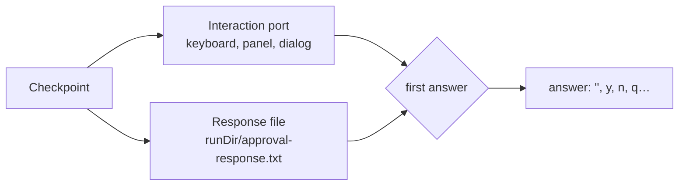

# Human in the loop

A **checkpoint** is a moment when the agent stops and waits for a person. The kit has two kinds:

| Kind | Asked by | Answers | Page |
| --- | --- | --- | --- |
| Decision | the [step gate](step-gate.md) (interactive mode) and the [approval tool](approvals.md) (guided mode) | Yes, No, Stop | [Step gate](step-gate.md), [Approvals](approvals.md) |
| Manual intervention | the [manual login tool](manual-intervention.md) | Done, continue | [Manual intervention](manual-intervention.md) |

Your own tools and hooks can ask too, with the same functions: [`askForDecision()`](#asking-from-your-own-code) and `askForManualIntervention()`.

## Two channels, first answer wins

Every checkpoint is asked on two channels at once:

1. **The interaction port**: the terminal, a panel in the Ink UI, or a dialog in your own app. See [Interaction port](interaction-port.md).
2. **The response file**: `<runDir>/approval-response.txt`. Anything else (a script, another program, Claude Code driving the agent) answers by writing to it. See [Response file](response-file.md).



When one channel answers, the other is cancelled: the port's question is withdrawn (the panel closes, with a note that it was answered through the file), and the file is deleted.

A port that can't ask (no TTY, no window) simply never answers, so the file wins. An agent running in the background still works: it waits for the file.

## What the panels look like

In the Ink chat, a decision is a bordered panel with the question's title and details, and numbered choices:

```text
╭──────────────────────────────────────────────────────────────╮
│ Human confirmation required before publishing                │
│ Summary: post the weekly summary in the course forum         │
│                                                              │
│ Do you want to proceed?                                      │
│ ❯ 1. Yes                                                     │
│   2. No                                                      │
│   3. Stop                                                    │
╰──────────────────────────────────────────────────────────────╯
```

- ↑/↓ and Enter, the digits `1`-`3`, or `y`, `n`, `q` answer.
- Ctrl+C answers **Stop** and interrupts the turn.
- The outcome stays in the history (`✔ Approved`, `✘ Rejected`, `■ Stopped`).

Long previews (a step gate showing a whole file as a tool parameter) are cut to fit the terminal. Replace the preview with your own rendering with the chat's `renderApproval` option (see [Ink chat](../terminal-ui/ink-chat.md#approval-panels)).

In the plain chat and without Ink, the checkpoint is printed as `=== Title ===`, the lines, and a question (`Allow this to continue? [Y/n/q]`).

## Asking from your own code

`askForDecision(runDir, prompt)` and `askForManualIntervention(runDir, prompt)` race the port and the response file exactly like the kit's checkpoints, and resolve with the answer lowercased and trimmed:

```ts
import { askForDecision, createSdkMcpServer, tool } from "@falkenslab/agent-kit";
import { z } from "zod";

function createRefundServer(runDir: string) {
  return createSdkMcpServer({
    name: "billing",
    version: "1.0.0",
    tools: [
      tool(
        "refund",
        "Refund an order. A person always confirms it first.",
        { orderId: z.string(), amount: z.number() },
        async ({ orderId, amount }) => {
          const answer = await askForDecision(runDir, {
            title: "Refund",
            lines: [`Order: ${orderId}`, `Amount: ${amount.toFixed(2)} €`],
          });
          if (answer !== "" && answer !== "y" && answer !== "yes") {
            return { content: [{ type: "text" as const, text: "The refund was not approved." }], isError: true };
          }
          await billing.refund(orderId, amount);
          return { content: [{ type: "text" as const, text: `Refunded ${amount.toFixed(2)} € for ${orderId}.` }] };
        },
      ),
    ],
  });
}

// buildMcpServers: (config, runDir) => ({ billing: createRefundServer(runDir) }),
```

Unlike the approval tool, this confirmation doesn't depend on the model choosing to ask: the tool always asks, in every mode.
