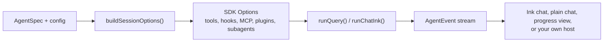

# agent-kit

`@falkenslab/agent-kit` is scaffolding for building agents on top of the [Claude Agent SDK](https://www.npmjs.com/package/@anthropic-ai/claude-agent-sdk) (`@anthropic-ai/claude-agent-sdk`). It isn't an agent: it solves once what every agent needs, so a concrete agent only writes what belongs to its own domain.

## What the kit gives an agent

| Area | What you get |
| --- | --- |
| Oversight | Three modes: `autonomous`, `guided` (an approval before anything visible or hard to undo) and `interactive` (an approval before every tool call). Guided and interactive switch into each other live. |
| Human in the loop | Approval and manual-intervention checkpoints, answered from the keyboard, from a panel in the Ink UI, from a desktop app through an `InteractionPort`, or by writing a response file. |
| Safety | Hooks that keep the file tools inside the agent's own folders, protect paths, keep Bash for subagents only, allow only the subagents you declare and run them in the foreground. |
| Memory | A built-in knowledge base (an "LLM wiki" the agent maintains), originals kept untouched in a sources folder, and every conversation stored in its run folder to resume it later. |
| Tools | Your own MCP servers (in-process or external), skills and slash commands in plugins, and subagents. |
| Terminal UI | A full screen Ink chat modelled on Claude Code, a plain readline chat, a progress view for one-shot runs and a question wizard, with themes and four languages. |
| Hosts | A core that never touches the terminal, a normalized event stream (`runQuery()`), and ports so a desktop app or a server can drive the same agent. |
| Trail | A session log of what the terminal showed and a transcript of every tool call with secrets redacted. |

## What an agent writes itself

An agent implements one small contract, [`AgentSpec`](core-concepts/agent-spec.md): its system prompt, the MCP servers it always has, the folders with its skills and commands, and its subagents. Everything else is configuration:

- a config object ([`BaseSessionConfig`](core-concepts/session-config.md), extended with the agent's own fields) with the mode and the folders it works in;
- the options of the UI it wants (a header, a welcome message, a theme, its own texts).

`buildSessionOptions()` turns the spec and the config into the SDK's `Options` for `query()`, and a chat or a progress view runs the session.

## How this documentation is organized

1. **[Getting started](getting-started/installation.md)**: install the kit, authenticate, and build a first agent step by step.
2. **[Core concepts](core-concepts/architecture.md)**: the architecture, `AgentSpec`, the session config, the modes and exactly what `buildSessionOptions()` builds.
3. **[Capabilities](capabilities/tools-and-mcp.md)**: tools and MCP servers, skills and plugins, subagents, the knowledge base and prompt files.
4. **[Human in the loop](human-in-the-loop/overview.md)**: checkpoints, the response file and custom interaction ports.
5. **[Security](security/overview.md)**: every guardrail and why it exists.
6. **[Terminal UI](terminal-ui/ink-chat.md)**: the chats, the progress view, the wizard, tool labels and themes.
7. **[Sessions](sessions/runs-and-resuming.md)**: run folders and resuming, languages, context size and cost.
8. **[Advanced](advanced/events.md)**: the event stream, one-shot runs, hosts without a terminal and your own hooks.
9. **[Examples](examples/captain-whiskers.md)**: Captain Whiskers, file by file, and short recipes.
10. **[Reference](reference/sdk-behaviors.md)**: SDK behaviors the kit relies on, troubleshooting and versioning.
11. **[API reference](api/index.md)**: every export, generated from the source.

:::info Requirements
Node.js 20 or later, and a Claude subscription token or an Anthropic API key. The kit is ESM only and written in TypeScript; its type declarations ship with the package.
:::
